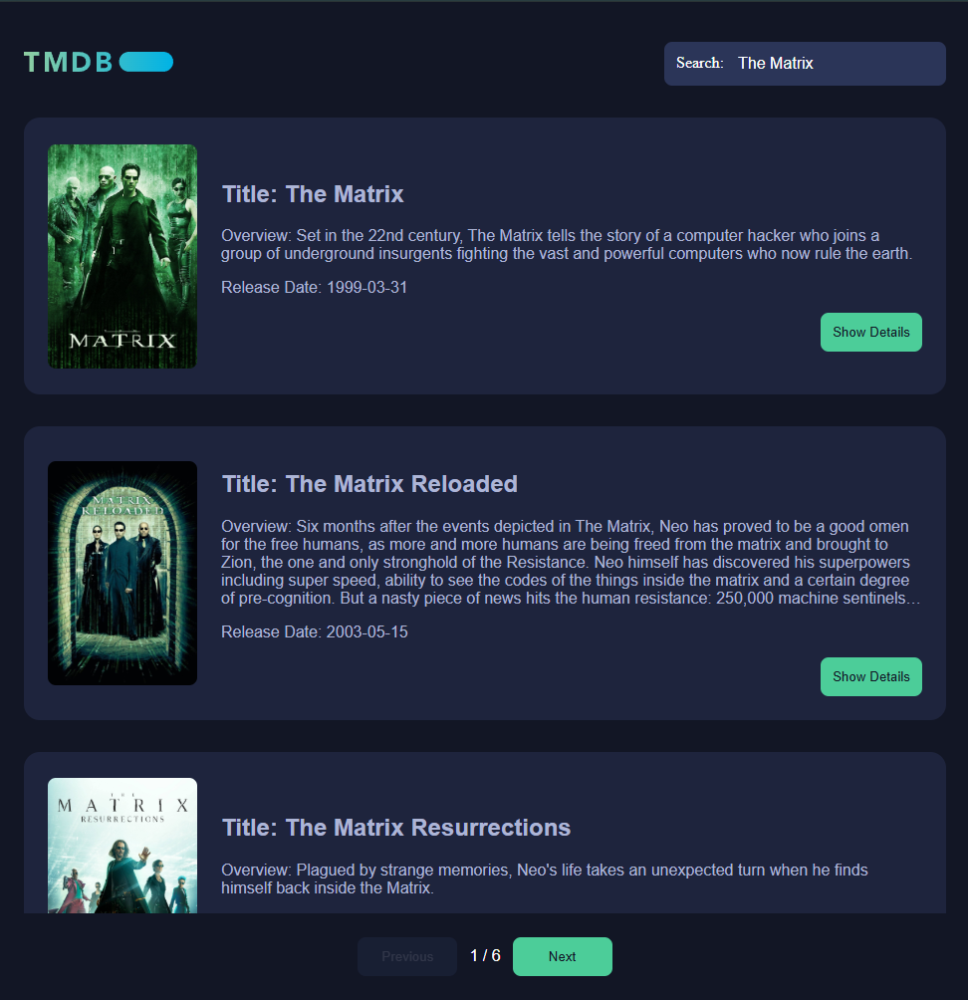
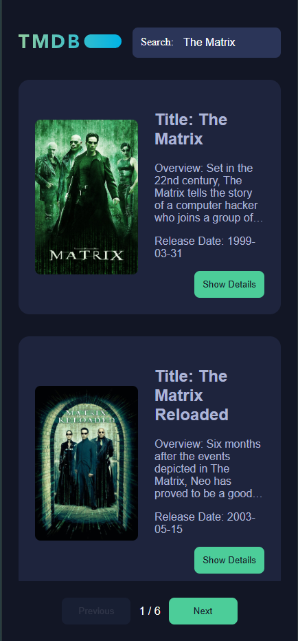
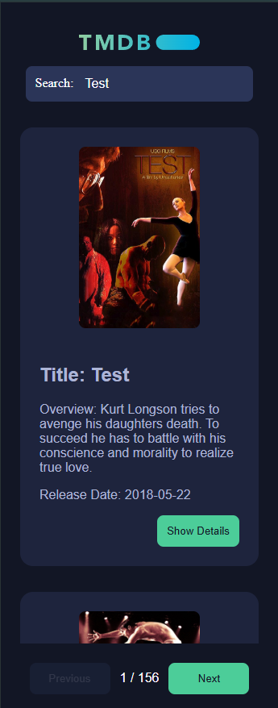

# enlab
Entain test task

## Used Node v22.14.0

## Installation

```
git clone https://github.com/DexArt/enlab.git
cd enlab
```

### Make sure ports 4173 for frontend and 8443 for proxy are available

## How to run:
```bash
./run.sh
```
#### OR

Nest js
```
yarn 
cd movie-proxy
yarn build 
yarn start
```

Frontend (NB! Nest Js App first)

```
cd frontend
yarn generate
yarn build:prod
yarn start
```


## Desktop version


## Mobile version


